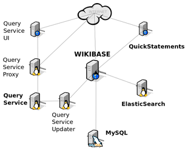

## Care and feeding of a Wikibase instance

Here are some resources to give you some insight into your Wikibase instance and to help keep it healthy and up to date.

### Architecture overview

First it's important to understand what you've got on your hands. Take a look at our [Docker architecture overview](https://github.com/wmde/wikibase-docker#wikibase-docker). 

And here's an architecture table with a diagram (click to enlarge):

<table>
<tbody>
<tr>
<td>

<table style="width: auto;" border="1">
<tbody>
<tr style="background-color:#D3D3D3;color:#ffffff;">
<td><b>Service name</b></td>
<td><b>Access</b></td>
<td><b>Notes</b></td>
</tr>
<tr>
<td><b>wikibase</b></td>
<td><a href="http://localhost:8181">localhost:8181</a></td>
<td>MediaWiki with the Wikibase extension</td>
</tr>
<tr>
<td><b>mysql</b></td>
<td>docker port 3006</td>
<td>the MySQL (MariaDB) database</td>
</tr>
<tr>
<td><b>elasticsearch</b></td>
<td>docker ports 9200, 9300</td>
<td>ElasticSearch</td>
</tr>
<tr>
<td><b>quickstatements</b></td>
<td><a href="http://localhost:9191">localhost:9191</a></td>
<td>QuickStatements</td>
</tr>
<tr>
<td><b>wdqs</b></td>
<td>docker port 9999</td>
<td>Wikidata query service</td>
</tr>
<tr>
<td><b>wdqs-proxy</b></td>
<td>localhost port 8989</td>
<td>Query service proxy</td>
</tr>
<tr>
<td><b>wdqs-frontend</b></td>
<td><a href="http://localhost:8282">localhost:8282</a></td>
<td>Query service frontend</td>
</tr>
</tbody>
</table>

</td>

<td>

<a href="{{site.url}}images/wikibase-diagram.png"></a>

</td>
</tbody>
</table>

<!--
[]({{site.url}}images/wikibase-diagram.png)
-->

### Docker tooling

The best tool for managing your Docker install is the one you used to get it going in the first place: **docker-compose**. This manual can't possibly replace a grounding in Docker so check out Docker's own command references for [docker-compose](https://docs.docker.com/compose/reference/) and the [docker engine](https://docs.docker.com/engine/reference/commandline/docker/).

That said, here are some starter commands that might come in handy.

#### Get a command shell on an instance

You won't need it for typical Wikibase activity, but for Docker beginners here's one very useful command that connects to a running instance:

```
docker exec -it <instance name> bash
```

#### Copy a file to your local directory 
```
docker cp docker_wikibase_1:/var/www/html/LocalSettings.php LocalSettings.php
```

This also works in the other direction, and the combination is useful for, say, grabbing your LocalSettings.php, editing it and putting it right back.

```
docker cp LocalSettings.php docker_wikibase_1:/var/www/html/LocalSettings.php 
```

Read [Adam Shorland's excellent blog post](https://addshore.com/2018/06/customizing-wikibase-config-in-the-docker-compose-example/) for more detail on modifying files on containers.

#### Stop the Docker containers

This command stops the Docker containers, leaving the machines (and of course all data) intact:

`docker-compose stop`

As you might imagine, you can use `docker-compose start` to start them again.

#### Delete the containers while preserving data

This command removes the containers but preserves all data in MySQL, MediaWiki and the query service in Docker volumes.

`docker-compose down`

#### Delete everything

**WARNING**: this will remove ALL of the data you ever added to your Docker install, which includes MediaWiki, Wikibase, ElasticSearch and the MySQL database. There's no coming back from this!

`docker-compose down --volumes`


#### Logs

Each application in the Wikibase cluster has its own log output. Consult each service's own documentation to learn how to read its logs.

In the directory where you placed your `docker-compose.yml` file, run the `docker-compose` command and the name of the service (cf. table above) to see its logs. For example:
```
user@host:~/docker$ docker-compose logs mysql
mysql_1 | 2019-12-31 10:00:00+00:00 [Note] [Entrypoint]: Entrypoint script for MySQL Server started.
mysql_1 | 2019-12-31 10:00:00+00:00 [Note] [Entrypoint]: Switching to dedicated user 'mysql'
...
```

### Backup and restore

The data in your Wikibase instance is valuable. Regular backups and tested restores of data are vital.

Regardless of whether you choose to make backups on the Docker level or inside your Docker containers, the two kinds of data you'll need to back up are the changed items on the MediaWiki/Wikibase filesystem and, more importantly, the MySQL database.

#### Docker level

For a helpful overview of Docker data backup and restore, including the use of the `docker save` and `docker load` commands, read this excellent [StackOverflow post](https://stackoverflow.com/questions/26331651/how-can-i-backup-a-docker-container-with-its-data-volumes#26339848). It's been updated several times since its original posting in 2014 and constitutes a great tour and jumping-off point for the docker command-line reference linked above.

#### On-container level

Read the documentation on [backing up a MediaWiki](https://www.mediawiki.org/wiki/Manual:Backing_up_a_wiki), bearing in mind that the work needs to be done from within the containers. 


### Wiki tools

Wikibase is an extension of MediaWiki. Much of the functionality you'll be working with is actually that of MediaWiki, so consult the [MediaWiki technical manual](https://www.mediawiki.org/wiki/Manual:Contents) and the [administrator's hub](https://www.mediawiki.org/wiki/Sysadmin_hub). Of particular note:

* [User guide](https://www.mediawiki.org/wiki/Help:Contents)
* [User rights management](https://www.mediawiki.org/wiki/Manual:User_rights)
* [Wiki admin guide](https://www.mediawiki.org/wiki/Manual:Administrators)

